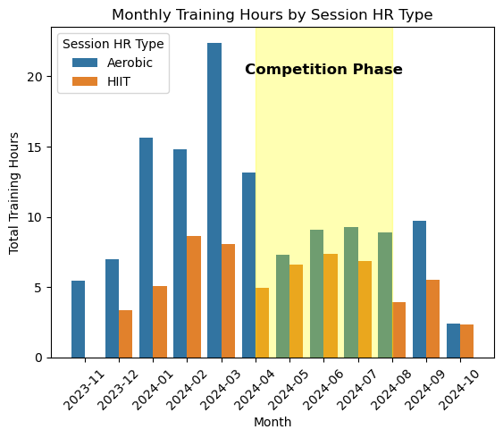

# Swimming Intensity Distribution EDA Using Form Swim Data

This is an EDA using data from my FORM swim goggles to explore the distribution of different workout intensities. I've been aiming to use a polarized approach to my training, which was popularized by Dr. Stephen Seiler. This approach involves doing roughly 80% of my training at low intensities, often refered to as the aerobic zone. This can be definied in a variety of ways, which this EDA will explore. 

Dr. Seiler admits that the distribution will shift based on what metric you are following. For example, using heart rate in a high intensity interval session can be misleading as a 8 lap VO2 max effort will show the heart rate ramping up into the HIIT zone and therefore may show 2 of the 8 laps in an aerobic zone.  Therefore, I'll take a look at the following apporaches to see how the distribution changes: 

* Session Type by Max HR 
* Average Heart Rate
* Training Hours Per Month

Before we dive in let's import the data, relevant packages, and clean the data. 

## Set Working Drive & Import Packages


```python
#Setting the working drive to the folder containing the FORM goggle csvs
%cd ~/Desktop/Form
```

    /Users/mattmyers/Desktop/Form


```python
#Checking the working drive has been set properly.
import os
print(os.getcwd())
```

    /Users/mattmyers/Desktop/Form


```python
#Import opperational packages.
import numpy as np 
import pandas as pd
from pandas import Series, DataFrame
import glob

#Import visualization packages. 
import matplotlib.pyplot as plt
import matplotlib.dates as mdates
import seaborn as sns
```

## Import FORM CSVs


```python
#Using glob to get a list of file names in my target folder. 
glob.glob('FORM*.csv')
```


    ['FORM_2024-07-30_130447.csv',
     'FORM_2024-01-12_060826.csv',
     'FORM_2024-04-16_105410.csv',
     'FORM_2024-02-10_090620.csv',
     'FORM_2024-04-28_141358.csv',
     'FORM_2024-04-30_120916.csv',
     'FORM_2024-06-01_090353.csv',
     'FORM_2024-02-03_090126.csv',
     'FORM_2024-06-09_123834.csv',
     'FORM_2024-08-29_113146.csv',
     'FORM_2024-02-07_092942.csv',
     'FORM_2024-03-07_113329.csv',
     'FORM_2024-04-04_093443.csv',
     'FORM_2024-03-20_113555.csv',
     'FORM_2024-09-17_155834.csv',
     'FORM_2024-06-28_114351.csv',
     'FORM_2024-07-12_121907.csv',
     'FORM_2024-09-07_085925.csv',
     'FORM_2024-02-11_094005.csv',
     'FORM_2024-01-20_090133.csv',
     'FORM_2024-06-21_134202.csv',
     'FORM_2024-01-30_121557.csv',
     'FORM_2024-03-28_113627.csv',
     'FORM_2024-06-30_160447.csv',
     'FORM_2024-03-22_113508.csv',
     'FORM_2024-07-05_053427.csv',
     'FORM_2024-09-27_130748.csv',
     'FORM_2024-09-16_114540.csv',
     'FORM_2024-06-25_120627.csv',
     'FORM_2024-07-17_114837.csv',
     'FORM_2023-12-01_060522.csv',
     'FORM_2024-04-19_132344.csv',
     'FORM_2024-07-08_114810.csv',
     'FORM_2024-06-04_130938.csv',
     'FORM_2024-05-14_123640.csv',
     'FORM_2024-03-31_144555.csv',
     'FORM_2024-05-24_113256.csv',
     'FORM_2024-09-10_130413.csv',
     'FORM_2024-06-17_114743.csv',
     'FORM_2024-07-16_150942.csv',
     'FORM_2024-07-28_065005.csv',
     'FORM_2024-04-03_053606.csv',
     'FORM_2024-01-25_081834.csv',
     'FORM_2024-02-17_090332.csv',
     'FORM_2024-04-11_113006.csv',
     'FORM_2024-05-28_114434.csv',
     'FORM_2024-09-19_141123.csv',
     'FORM_2024-09-14_090355.csv',
     'FORM_2024-04-18_101454.csv',
     'FORM_2024-02-13_084925.csv',
     'FORM_2024-08-10_090124.csv',
     'FORM_2024-04-12_152647.csv',
     'FORM_2024-07-26_114619.csv',
     'FORM_2024-09-05_114254.csv',
     'FORM_2024-02-19_075417.csv',
     'FORM_2024-04-13_090218.csv',
     'FORM_2024-05-11_090300.csv',
     'FORM_2024-03-12_113409.csv',
     'FORM_2024-02-23_132005.csv',
     'FORM_2024-08-26_115355.csv',
     'FORM_2024-08-11_071111.csv',
     'FORM_2024-01-09_055250.csv',
     'FORM_2024-06-07_131324.csv',
     'FORM_2024-01-13_090516.csv',
     'FORM_2024-03-27_113626.csv',
     'FORM_2024-01-22_091950.csv',
     'FORM_2024-04-25_113133.csv',
     'FORM_2023-12-15_054419.csv',
     'FORM_2024-06-14_130703.csv',
     'FORM_2024-09-18_155201.csv',
     'FORM_2023-12-10_093021.csv',
     'FORM_2024-08-31_084838.csv',
     'FORM_2024-08-01_070909.csv',
     'FORM_2023-12-16_090132.csv',
     'FORM_2024-10-08_141651.csv',
     'FORM_2024-07-21_070821.csv',
     'FORM_2024-04-10_141947.csv',
     'FORM_2024-08-08_114604.csv',
     'FORM_2024-07-14_114916.csv',
     'FORM_2024-08-05_100100.csv',
     'FORM_2024-05-03_133617.csv',
     'FORM_2024-05-21_122017.csv',
     'FORM_2024-03-11_062258.csv',
     'FORM_2024-03-15_113427.csv',
     'FORM_2024-03-19_113448.csv',
     'FORM_2024-08-30_091910.csv',
     'FORM_2024-09-04_155417.csv',
     'FORM_2024-10-14_114523.csv',
     'FORM_2023-11-26_130651.csv',
     'FORM_2024-06-20_053324.csv',
     'FORM_2024-05-30_121121.csv',
     'FORM_2024-09-28_090102.csv',
     'FORM_2024-02-20_081114.csv',
     'FORM_2024-06-03_114733.csv',
     'FORM_2024-06-12_114916.csv',
     'FORM_2024-02-26_105747.csv',
     'FORM_2024-02-24_085938.csv',
     'FORM_2024-09-06_122617.csv',
     'FORM_2024-05-23_120505.csv',
     'FORM_2024-03-25_113657.csv',
     'FORM_2024-06-18_114804.csv',
     'FORM_2024-07-01_114403.csv',
     'FORM_2024-08-14_121134.csv',
     'FORM_2024-02-02_093141.csv',
     'FORM_2024-06-05_114921.csv',
     'FORM_2024-04-15_112717.csv',
     'FORM_2024-05-26_130704.csv',
     'FORM_2024-01-29_130758.csv',
     'FORM_2024-07-15_114756.csv',
     'FORM_2024-04-21_140318.csv',
     'FORM_2024-08-09_103337.csv',
     'FORM_2024-09-11_060609.csv',
     'FORM_2024-02-27_060618.csv',
     'FORM_2024-03-13_113620.csv',
     'FORM_2024-08-15_114529.csv',
     'FORM_2024-06-27_121644.csv',
     'FORM_2023-11-30_055303.csv',
     'FORM_2024-01-31_101330.csv',
     'FORM_2024-06-26_121006.csv',
     'FORM_2024-07-25_120859.csv',
     'FORM_2023-12-18_125203.csv',
     'FORM_2023-11-24_093427.csv',
     'FORM_2023-12-11_053248.csv',
     'FORM_2024-05-06_113131.csv',
     'FORM_2024-01-23_131202.csv',
     'FORM_2024-03-06_113701.csv',
     'FORM_2024-09-03_160821.csv',
     'FORM_2024-03-18_060820.csv',
     'FORM_2023-12-20_113303.csv',
     'FORM_2024-01-27_074441.csv',
     'FORM_2024-02-22_085533.csv',
     'FORM_2024-06-13_053354.csv',
     'FORM_2024-05-01_122201.csv',
     'FORM_2024-07-09_160229.csv',
     'FORM_2024-07-11_053700.csv',
     'FORM_2024-08-09_080404.csv',
     'FORM_2024-01-08_053450.csv',
     'FORM_2024-07-23_121634.csv',
     'FORM_2024-01-14_142548.csv',
     'FORM_2024-09-09_114337.csv',
     'FORM_2024-03-21_113420.csv',
     'FORM_2024-10-02_125221.csv',
     'FORM_2024-07-10_114557.csv',
     'FORM_2024-03-05_113643.csv',
     'FORM_2024-07-22_114619.csv',
     'FORM_2024-03-02_090049.csv',
     'FORM_2024-03-03_141052.csv',
     'FORM_2024-05-16_112906.csv',
     'FORM_2024-03-01_083615.csv',
     'FORM_2024-04-02_113422.csv',
     'FORM_2024-09-20_121101.csv',
     'FORM_2024-03-26_113652.csv',
     'FORM_2024-08-28_121928.csv',
     'FORM_2024-01-11_060714.csv',
     'FORM_2024-01-19_061801.csv',
     'FORM_2024-09-25_124524.csv',
     'FORM_2024-10-11_144736.csv',
     'FORM_2024-10-04_114803.csv',
     'FORM_2024-02-05_084644.csv',
     'FORM_2024-10-12_090145.csv',
     'FORM_2024-08-25_070218.csv',
     'FORM_2024-06-10_114611.csv',
     'FORM_2024-02-09_083622.csv',
     'FORM_2024-06-24_114637.csv',
     'FORM_2024-07-02_062949.csv',
     'FORM_2024-05-13_113310.csv',
     'FORM_2024-02-08_090906.csv',
     'FORM_2023-12-19_065039.csv',
     'FORM_2024-05-22_113131.csv',
     'FORM_2024-09-13_095911.csv',
     'FORM_2024-09-30_114617.csv',
     'FORM_2024-04-24_125733.csv',
     'FORM_2024-06-16_120719.csv',
     'FORM_2024-05-29_064616.csv',
     'FORM_2024-07-31_114556.csv',
     'FORM_2024-02-06_091157.csv',
     'FORM_2024-03-08_115042.csv',
     'FORM_2024-01-16_062249.csv',
     'FORM_2024-07-18_053522.csv',
     'FORM_2024-03-14_113418.csv',
     'FORM_2024-08-27_122014.csv',
     'FORM_2023-12-12_054359.csv',
     'FORM_2024-01-17_062226.csv',
     'FORM_2024-07-24_114516.csv',
     'FORM_2024-08-24_110442.csv',
     'FORM_2024-02-14_084800.csv',
     'FORM_2024-10-09_114726.csv',
     'FORM_2023-11-29_060521.csv',
     'FORM_2024-06-06_053402.csv',
     'FORM_2024-04-01_122532.csv',
     'FORM_2024-04-23_113020.csv',
     'FORM_2024-04-17_113012.csv',
     'FORM_2024-07-19_120639.csv',
     'FORM_2024-08-13_114800.csv',
     'FORM_2024-05-02_112948.csv',
     'FORM_2023-12-14_054433.csv',
     'FORM_2024-02-28_093224.csv',
     'FORM_2024-07-03_114437.csv',
     'FORM_2024-05-15_112955.csv',
     'FORM_2024-02-18_095627.csv',
     'FORM_2024-01-26_082254.csv',
     'FORM_2024-04-20_090330.csv',
     'FORM_2024-07-29_114507.csv',
     'FORM_2023-12-11_065211.csv',
     'FORM_2024-05-08_113212.csv',
     'FORM_2024-05-20_113433.csv']


```python
#Using glob.glob to pass a list of file names into a list comprehension that uses pd.read_csv(). 
all_dfs = [pd.read_csv(one_filename, skiprows=3) #Note I'm skipping the first three rows which contain metadata for each CSV. 
    for one_filename in glob.glob('FORM*.csv')
          ]
```


```python
#Combinging all_dfs into a master dataframe using pd.concat().
df = pd.concat(all_dfs)
```


```python
#Checking the shape of our new master dataframe. 
df.shape
```


    (37954, 28)


We now have a single dataframe that has 37954 observations and 28 variables. Now we can clean this data. 

## Data Cleaning

### Columns


```python
#Checking the head of my dataframe. 
df.head(5)
```


<div>
<style scoped>
    .dataframe tbody tr th:only-of-type {
        vertical-align: middle;
    }

    .dataframe tbody tr th {
        vertical-align: top;
    }

    .dataframe thead th {
        text-align: right;
    }
</style>
<table border="1" class="dataframe">
  <thead>
    <tr style="text-align: right;">
      <th></th>
      <th>Swim Date</th>
      <th>Swim Time</th>
      <th>Set #</th>
      <th>Set</th>
      <th>Interval (yd)</th>
      <th>Length (yd)</th>
      <th>Strk</th>
      <th>Move Time</th>
      <th>Rest Time</th>
      <th>Cumul Time</th>
      <th>...</th>
      <th>Pace/50</th>
      <th>SWOLF</th>
      <th>Avg Strk Rate (strk/min)</th>
      <th>Strk Count</th>
      <th>Avg Strk Count/Len</th>
      <th>Calories</th>
      <th>Interval (m)</th>
      <th>Length (m)</th>
      <th>Dist (m)</th>
      <th>Cumul Dist (m)</th>
    </tr>
  </thead>
  <tbody>
    <tr>
      <th>0</th>
      <td>07/30/2024</td>
      <td>01:04:47PM</td>
      <td>1</td>
      <td>1x325</td>
      <td>325.0</td>
      <td>25.0</td>
      <td>FR</td>
      <td>0:20.75</td>
      <td>0:00.00</td>
      <td>0:20.75</td>
      <td>...</td>
      <td>0:41.53</td>
      <td>36</td>
      <td>48</td>
      <td>15</td>
      <td>15</td>
      <td>3</td>
      <td>NaN</td>
      <td>NaN</td>
      <td>NaN</td>
      <td>NaN</td>
    </tr>
    <tr>
      <th>1</th>
      <td>07/30/2024</td>
      <td>01:05:08PM</td>
      <td>1</td>
      <td>1x325</td>
      <td>325.0</td>
      <td>25.0</td>
      <td>FR</td>
      <td>0:19.64</td>
      <td>0:00.00</td>
      <td>0:40.40</td>
      <td>...</td>
      <td>0:39.28</td>
      <td>32</td>
      <td>48</td>
      <td>12</td>
      <td>12</td>
      <td>2</td>
      <td>NaN</td>
      <td>NaN</td>
      <td>NaN</td>
      <td>NaN</td>
    </tr>
    <tr>
      <th>2</th>
      <td>07/30/2024</td>
      <td>01:05:27PM</td>
      <td>1</td>
      <td>1x325</td>
      <td>325.0</td>
      <td>25.0</td>
      <td>FR</td>
      <td>0:19.89</td>
      <td>0:00.00</td>
      <td>1:00.28</td>
      <td>...</td>
      <td>0:39.76</td>
      <td>32</td>
      <td>47</td>
      <td>12</td>
      <td>12</td>
      <td>2</td>
      <td>NaN</td>
      <td>NaN</td>
      <td>NaN</td>
      <td>NaN</td>
    </tr>
    <tr>
      <th>3</th>
      <td>07/30/2024</td>
      <td>01:05:47PM</td>
      <td>1</td>
      <td>1x325</td>
      <td>325.0</td>
      <td>25.0</td>
      <td>FR</td>
      <td>0:20.36</td>
      <td>0:00.00</td>
      <td>1:20.64</td>
      <td>...</td>
      <td>0:40.71</td>
      <td>32</td>
      <td>47</td>
      <td>12</td>
      <td>12</td>
      <td>2</td>
      <td>NaN</td>
      <td>NaN</td>
      <td>NaN</td>
      <td>NaN</td>
    </tr>
    <tr>
      <th>4</th>
      <td>07/30/2024</td>
      <td>01:06:07PM</td>
      <td>1</td>
      <td>1x325</td>
      <td>325.0</td>
      <td>25.0</td>
      <td>FR</td>
      <td>0:20.43</td>
      <td>0:00.00</td>
      <td>1:41.07</td>
      <td>...</td>
      <td>0:40.86</td>
      <td>32</td>
      <td>46</td>
      <td>12</td>
      <td>12</td>
      <td>3</td>
      <td>NaN</td>
      <td>NaN</td>
      <td>NaN</td>
      <td>NaN</td>
    </tr>
  </tbody>
</table>
<p>5 rows × 28 columns</p>
</div>


```python
df.columns
```


    Index(['Swim Date', 'Swim Time', 'Set #', 'Set', 'Interval (yd)',
           'Length (yd)', 'Strk', 'Move Time', 'Rest Time', 'Cumul Time', 'Len',
           'Dist (yd)', 'Cumul Dist (yd)', 'Avg DPS', 'Avg BPM (moving)',
           'Max BPM', 'Min BPM (resting)', 'Pace/100', 'Pace/50', 'SWOLF',
           'Avg Strk Rate (strk/min)', 'Strk Count', 'Avg Strk Count/Len',
           'Calories', 'Interval (m)', 'Length (m)', 'Dist (m)', 'Cumul Dist (m)'],
          dtype='object')


```python
#We have some excess columns from the sessions swum in 50 meter pools versus 25 yard pools. For this EDA I will simply drop these columns. 
df_yards = df.drop(['Interval (m)', 'Length (m)', 'Dist (m)', 'Cumul Dist (m)'], axis = 1)
```


```python
df_yards.head()
```


<div>
<style scoped>
    .dataframe tbody tr th:only-of-type {
        vertical-align: middle;
    }

    .dataframe tbody tr th {
        vertical-align: top;
    }

    .dataframe thead th {
        text-align: right;
    }
</style>
<table border="1" class="dataframe">
  <thead>
    <tr style="text-align: right;">
      <th></th>
      <th>Swim Date</th>
      <th>Swim Time</th>
      <th>Set #</th>
      <th>Set</th>
      <th>Interval (yd)</th>
      <th>Length (yd)</th>
      <th>Strk</th>
      <th>Move Time</th>
      <th>Rest Time</th>
      <th>Cumul Time</th>
      <th>...</th>
      <th>Avg BPM (moving)</th>
      <th>Max BPM</th>
      <th>Min BPM (resting)</th>
      <th>Pace/100</th>
      <th>Pace/50</th>
      <th>SWOLF</th>
      <th>Avg Strk Rate (strk/min)</th>
      <th>Strk Count</th>
      <th>Avg Strk Count/Len</th>
      <th>Calories</th>
    </tr>
  </thead>
  <tbody>
    <tr>
      <th>0</th>
      <td>07/30/2024</td>
      <td>01:04:47PM</td>
      <td>1</td>
      <td>1x325</td>
      <td>325.0</td>
      <td>25.0</td>
      <td>FR</td>
      <td>0:20.75</td>
      <td>0:00.00</td>
      <td>0:20.75</td>
      <td>...</td>
      <td>111</td>
      <td>115</td>
      <td>0</td>
      <td>1:23.05</td>
      <td>0:41.53</td>
      <td>36</td>
      <td>48</td>
      <td>15</td>
      <td>15</td>
      <td>3</td>
    </tr>
    <tr>
      <th>1</th>
      <td>07/30/2024</td>
      <td>01:05:08PM</td>
      <td>1</td>
      <td>1x325</td>
      <td>325.0</td>
      <td>25.0</td>
      <td>FR</td>
      <td>0:19.64</td>
      <td>0:00.00</td>
      <td>0:40.40</td>
      <td>...</td>
      <td>109</td>
      <td>111</td>
      <td>0</td>
      <td>1:18.56</td>
      <td>0:39.28</td>
      <td>32</td>
      <td>48</td>
      <td>12</td>
      <td>12</td>
      <td>2</td>
    </tr>
    <tr>
      <th>2</th>
      <td>07/30/2024</td>
      <td>01:05:27PM</td>
      <td>1</td>
      <td>1x325</td>
      <td>325.0</td>
      <td>25.0</td>
      <td>FR</td>
      <td>0:19.89</td>
      <td>0:00.00</td>
      <td>1:00.28</td>
      <td>...</td>
      <td>105</td>
      <td>109</td>
      <td>0</td>
      <td>1:19.51</td>
      <td>0:39.76</td>
      <td>32</td>
      <td>47</td>
      <td>12</td>
      <td>12</td>
      <td>2</td>
    </tr>
    <tr>
      <th>3</th>
      <td>07/30/2024</td>
      <td>01:05:47PM</td>
      <td>1</td>
      <td>1x325</td>
      <td>325.0</td>
      <td>25.0</td>
      <td>FR</td>
      <td>0:20.36</td>
      <td>0:00.00</td>
      <td>1:20.64</td>
      <td>...</td>
      <td>104</td>
      <td>113</td>
      <td>0</td>
      <td>1:21.43</td>
      <td>0:40.71</td>
      <td>32</td>
      <td>47</td>
      <td>12</td>
      <td>12</td>
      <td>2</td>
    </tr>
    <tr>
      <th>4</th>
      <td>07/30/2024</td>
      <td>01:06:07PM</td>
      <td>1</td>
      <td>1x325</td>
      <td>325.0</td>
      <td>25.0</td>
      <td>FR</td>
      <td>0:20.43</td>
      <td>0:00.00</td>
      <td>1:41.07</td>
      <td>...</td>
      <td>118</td>
      <td>122</td>
      <td>0</td>
      <td>1:21.72</td>
      <td>0:40.86</td>
      <td>32</td>
      <td>46</td>
      <td>12</td>
      <td>12</td>
      <td>3</td>
    </tr>
  </tbody>
</table>
<p>5 rows × 24 columns</p>
</div>


### Data Types


```python
df_yards.dtypes
```


    Swim Date                    object
    Swim Time                    object
    Set #                         int64
    Set                          object
    Interval (yd)               float64
    Length (yd)                 float64
    Strk                         object
    Move Time                    object
    Rest Time                    object
    Cumul Time                   object
    Len                           int64
    Dist (yd)                   float64
    Cumul Dist (yd)             float64
    Avg DPS                     float64
    Avg BPM (moving)              int64
    Max BPM                       int64
    Min BPM (resting)             int64
    Pace/100                     object
    Pace/50                      object
    SWOLF                         int64
    Avg Strk Rate (strk/min)      int64
    Strk Count                    int64
    Avg Strk Count/Len            int64
    Calories                      int64
    dtype: object


The data types for time are all imported as objects. I'll change 'Swim Date', 'Swim Time' to **datetime** and 'Move Time', 'Rest Time', 'Cumul Time', 'Pace/100', 'Pace/50' to durations. 

I'll use pd.datetime() to make a datetime column with datatype datetime64. 

I'll use pd.to_timedelta to make 'Move Time', 'Rest Time', 'Cumul Time', 'Pace/100', 'Pace/50' datatype timedelta64. 


```python
df_yards['datetime'] = pd.to_datetime(df_yards['Swim Date'] + ' ' + df_yards['Swim Time'], format='%m/%d/%Y %I:%M:%S%p')
```


```python
df_yards.dtypes
```


    Swim Date                            object
    Swim Time                            object
    Set #                                 int64
    Set                                  object
    Interval (yd)                       float64
    Length (yd)                         float64
    Strk                                 object
    Move Time                   timedelta64[ns]
    Rest Time                   timedelta64[ns]
    Cumul Time                  timedelta64[ns]
    Len                                   int64
    Dist (yd)                           float64
    Cumul Dist (yd)                     float64
    Avg DPS                             float64
    Avg BPM (moving)                      int64
    Max BPM                               int64
    Min BPM (resting)                     int64
    Pace/100                    timedelta64[ns]
    Pace/50                     timedelta64[ns]
    SWOLF                                 int64
    Avg Strk Rate (strk/min)              int64
    Strk Count                            int64
    Avg Strk Count/Len                    int64
    Calories                              int64
    datetime                     datetime64[ns]
    dtype: object


```python
# Creating a list of columns that need to be converted to timedelta64
duration_columns = ['Move Time', 'Rest Time', 'Cumul Time', 'Pace/100', 'Pace/50']

#Using lambda col: and pd.to_timedelta to convert our duration_columns to timedelta64 and an added '00:' in the hour place. 
df_yards[duration_columns] = df_yards[duration_columns].apply(
    lambda col: pd.to_timedelta("00:" + col, errors="coerce"))
```


```python
df_yards.dtypes
```


    Swim Date                            object
    Swim Time                            object
    Set #                                 int64
    Set                                  object
    Interval (yd)                       float64
    Length (yd)                         float64
    Strk                                 object
    Move Time                   timedelta64[ns]
    Rest Time                   timedelta64[ns]
    Cumul Time                  timedelta64[ns]
    Len                                   int64
    Dist (yd)                           float64
    Cumul Dist (yd)                     float64
    Avg DPS                             float64
    Avg BPM (moving)                      int64
    Max BPM                               int64
    Min BPM (resting)                     int64
    Pace/100                    timedelta64[ns]
    Pace/50                     timedelta64[ns]
    SWOLF                                 int64
    Avg Strk Rate (strk/min)              int64
    Strk Count                            int64
    Avg Strk Count/Len                    int64
    Calories                              int64
    datetime                     datetime64[ns]
    dtype: object


### Datetime Index
Now I will use pd.DateTimeIndex on the 'datetime' column. 


```python
df_yards.index = pd.DatetimeIndex(df_yards['datetime'])
df_yards = df_yards.drop(columns=['datetime'], errors='ignore')
```

### Heart Rate Zeros
Any zeros in 'AVG BPM (moving)' indicate an error in the heart rate monitor (unless I was actually dead on those laps with a heart rate of 0). 
We can check for zeros by using filtering for rows with zero in 'Avg BPM (moving)' and counting them. 


```python
df_yards[df_yards['Avg BPM (moving)'] == 0].count()
```


    Swim Date                   5750
    Swim Time                   5750
    Set #                       5750
    Set                         5750
    Interval (yd)               5057
    Length (yd)                 5057
    Strk                        5750
    Move Time                   5750
    Rest Time                   5750
    Cumul Time                  5750
    Len                         5750
    Dist (yd)                   5057
    Cumul Dist (yd)             5057
    Avg DPS                     5750
    Avg BPM (moving)            5750
    Max BPM                     5750
    Min BPM (resting)           5750
    Pace/100                    5750
    Pace/50                     5750
    SWOLF                       5750
    Avg Strk Rate (strk/min)    5750
    Strk Count                  5750
    Avg Strk Count/Len          5750
    Calories                    5750
    Interval_Category           5750
    Session HR Type             5750
    dtype: int64


```python
#Include rows with Avg BPM > 0
df_yards = df_yards[df_yards['Avg BPM (moving)'] > 0]
```


```python
#Confirm we no longer have rows with zero in the 'Avg BPM (moving)' column. 
df_yards[df_yards['Avg BPM (moving)'] == 0].count()
```


    Swim Date                   0
    Swim Time                   0
    Set #                       0
    Set                         0
    Interval (yd)               0
    Length (yd)                 0
    Strk                        0
    Move Time                   0
    Rest Time                   0
    Cumul Time                  0
    Len                         0
    Dist (yd)                   0
    Cumul Dist (yd)             0
    Avg DPS                     0
    Avg BPM (moving)            0
    Max BPM                     0
    Min BPM (resting)           0
    Pace/100                    0
    Pace/50                     0
    SWOLF                       0
    Avg Strk Rate (strk/min)    0
    Strk Count                  0
    Avg Strk Count/Len          0
    Calories                    0
    Interval_Category           0
    Session HR Type             0
    dtype: int64


## Training Distribution EDA

Now I am ready to look at a basic distribution of my training. 

As mentioned earlier, I typically aim for a polarized training distribution. This was popularized by Dr. Stephen Seiler and involves doing roughly 80% of one's training in an 'easy', aerobic zone. Therefore I usually swim two different sessions: continuous distance swimming at low heart rate and high intensity intervals done with a Masters team. I'll call the first one 'Aerobic' and the second I'll call 'High Intensity Interval Training' or 'HIIT'.

There is a number of ways to look at the distribution of training. I'll take the following approaches to get a sense for how I have trained:  

* Session Type by Max HR 
* Average Heart Rate
* Training Hours Per Month

### Session Type By Max HR 

In this section I'll designate each workout into two buckets (Aerobic or HIIT). My critieria is that if any of the laps in the session have a max heart rate above 165, then the session is likely a HIIT session. I usally aim to keep my heart rate below 140 in aerobic sessions. Of course, an occasional lap or two may drift up into the 150s. I'd guess virtually all of my HIIT sessions go above 165 at some point, though, so this should be a good starting point for labeling the two session types. 

To achieve this I start by grouping the data by day, filtering for any Max Heart Rate laps above 165, and using lambda to save a new column with the labels 'Aerobic' or 'HIIT'. 


```python
df_yards['Session HR Type'] = df_yards.groupby('Swim Date')['Max BPM'].transform(lambda x: 'HIIT' if (x >= 165).any() else 'Aerobic')
grouped_maxhr = df_yards.groupby('Session HR Type')
grouped_maxhr.size()
```


    Session HR Type
    Aerobic    20874
    HIIT       11330
    dtype: int64


```python
#Calculating the percentage of Aerobic vs. HIIT laps swum.
grouped_maxhr_counts = grouped_maxhr.size()
grouped_maxhr_percent = (grouped_maxhr_counts / grouped_maxhr_counts.sum())*100 

print(grouped_maxhr_percent)
```

    Session HR Type
    Aerobic    64.818035
    HIIT       35.181965
    dtype: float64


```python
#Visualizing the percentage of Aerobic vs. HIIT laps swum.
sns.barplot(grouped_maxhr_percent)
plt.title('Percentage of Aerobic vs. HIIT Laps Swum')
```


    Text(0.5, 1.0, 'Percentage of Aerobic vs. HIIT Laps Swum')


    

    


```python
#Resampling 'datetime' by days, then aggregating 'Session HR Type' to count how many Aerobic vs. HIIT sessions I did.  
session_days = df_yards.resample('D').agg({'Session HR Type': lambda x: set(x)}).explode('Session HR Type').value_counts().reset_index()

#creating dataframe for session_days
session_days.columns = ['Session HR Type', 'Count']
print(session_days)
```

      Session HR Type  Count
    0         Aerobic    120
    1            HIIT     84


```python
# Calculate the percentage of each session type
session_days['Percentage'] = session_days['Count'] / session_days['Count'].sum() * 100

print(session_days)
```

      Session HR Type  Count  Percentage
    0         Aerobic    120   58.823529
    1            HIIT     84   41.176471


```python
#Setting up 2 side by side plots. 
fig, axes = plt.subplots(1,2, figsize = (12,6))

#Visualizing session by count.
sns.barplot(data=session_days, x='Session HR Type', y='Count', ax=axes[0], hue = 'Session HR Type')
axes[0].set_title('Count of Aerobic vs. HIIT Sessions')

#Visualizing sessions type percentages.
sns.barplot(data=session_days, x='Session HR Type', y='Percentage', ax = axes[1], hue = 'Session HR Type')
axes[1].set_title('Percentage of Aerobic vs. HIIT Sessions')
```


    Text(0.5, 1.0, 'Percentage of Aerobic vs. HIIT Sessions')


    

    


Already we can see that by session type I have a roughly 60/40 split instead of the polarized 80/20. However, I often swim more laps in aerobic sessions hence the 65/35% split in laps swum aerobically vs. at high intensity. 


```python
df_yards['Interval_Category'] = df_yards['Interval (yd)'].apply(lambda x: '200+' if x >= 200 else '<200')

grouped = df_yards.groupby('Interval_Category')
```


```python
grouped.size()
```


    Interval_Category
    200+    18878
    <200    13326
    dtype: int64


```python
grouped_counts = grouped.size()
grouped_percents = (grouped_counts /grouped_counts.sum())* 100 #calculate the percentage of laps done in an interval greater than 500 yards.

print(grouped_percents)
```

    Interval_Category
    200+    58.620047
    <200    41.379953
    dtype: float64


### By Heart Rate

Now I'll look at the distribution of average heart rates on each lap. Let's start by getting the count for each heart rate. 


```python
df_yards['Avg BPM (moving)'].value_counts()
```


    Avg BPM (moving)
    144    1300
    142    1266
    143    1245
    139    1244
    141    1215
           ... 
    81        3
    77        1
    74        1
    78        1
    76        1
    Name: count, Length: 109, dtype: int64


```python
#Visualizing the lap count for each heart rate in a histogram.
sns.histplot(df_yards['Avg BPM (moving)'], kde = True)
```


    <Axes: xlabel='Avg BPM (moving)', ylabel='Count'>


    

    


```python
#Checking basic descriptive statistics about this distribution.
df_yards['Avg BPM (moving)'].describe()
```


    count    32204.000000
    mean       139.237144
    std         14.679046
    min         74.000000
    25%        132.000000
    50%        140.000000
    75%        147.000000
    max        184.000000
    Name: Avg BPM (moving), dtype: float64


Already we can note that the 75% is just about at my aerobic threshold of 150 bpm. Let's check what the 80th percentile is using the Pandas quantile method. 


```python
df_yards['Avg BPM (moving)'].quantile(0.80)
```


    np.float64(149.0)


This suggest 80 percent of laps swum were below my aerobic threshold of 150 bpm. Let's visualize this to make it clearer. 


```python
#Define bins by physiological zones. Aerobic = <150, Threshold > 150 & < 165, VO2 Max > 165
bins = [0,150,165,df_yards['Avg BPM (moving)'].max()]

#Create subplots
fig, axes = plt.subplots(1,2, figsize = (12,5)) #My figure will have one row, 2 columns.

#Create new histogram with counts and related labels
sns.histplot(df_yards['Avg BPM (moving)'], bins = bins, ax=axes[0])
axes[0].set_title('Histogram of Average Heart Rate (Count)')
axes[0].set_xlabel('Average Beats Per Minute (Moving)')
axes[0].set_ylabel('Count')
axes[0].set_xticks(bins)
axes[0].set_xticklabels(bins)

#Create new histogram with percents and related labels
sns.histplot(df_yards['Avg BPM (moving)'], bins = bins, stat = 'percent', ax=axes[1])
axes[1].set_title('Histogram of Average Heart Rate (Percent)')
axes[1].set_xlabel('Average Beats Per Minute (Moving)')
axes[1].set_ylabel('Percent')
axes[1].set_xticks(bins)
axes[1].set_xticklabels(bins)

#Adjust layout
plt.tight_layout()
plt.show()
```


    

    


This approach yields an 80/20 split almost on the dot. We can account for this partly with the number of aerobic laps swum within a HIIT workout during warm ups, drills, and easy swimming between hard intervals. Another explanation is the periodization of training in relation to competitions, which I will look at in the next section. 

### By Training Hours per Month

While I have aimed for an 80/20 split in general, I tweak this equation as I get closer to swim competitions in order to sharpen up the upper end of my physiology crucial to racing, especially given the shorter nature of swimming races in the 1-5 min range. Many endurance athletes with even longer races in the range of 1-6 hours will do a similar shift in high intensity training closer to big competitions. 

To start lets add up the number of Aerobic and HIIT training hours and resample by month to see how the distribution shifts across a competition season. 


```python
# Group by 'Session HR Type', resample for month end, and sum 'Move Time'
M = df_yards.groupby('Session HR Type').resample('ME')['Move Time'].sum()

#Convert 'Move Time' from seconds to hours. 
M_H = M.dt.total_seconds()/3600

#Reset index to make 'datetime' accessible as a column.
M_H = M_H.reset_index()

#Convert 'datetime' to only show year / month end. 
M_H['Month'] = M_H['datetime'].dt.to_period('M').astype(str)

# Print final result
print(M_H)
```

       Session HR Type   datetime  Move Time    Month
    0          Aerobic 2023-11-30   5.446503  2023-11
    1          Aerobic 2023-12-31   7.001583  2023-12
    2          Aerobic 2024-01-31  15.607200  2024-01
    3          Aerobic 2024-02-29  14.823872  2024-02
    4          Aerobic 2024-03-31  22.393542  2024-03
    5          Aerobic 2024-04-30  13.134761  2024-04
    6          Aerobic 2024-05-31   7.309186  2024-05
    7          Aerobic 2024-06-30   9.073161  2024-06
    8          Aerobic 2024-07-31   9.246342  2024-07
    9          Aerobic 2024-08-31   8.900117  2024-08
    10         Aerobic 2024-09-30   9.690906  2024-09
    11         Aerobic 2024-10-31   2.382506  2024-10
    12            HIIT 2023-12-31   3.333414  2023-12
    13            HIIT 2024-01-31   5.102939  2024-01
    14            HIIT 2024-02-29   8.641808  2024-02
    15            HIIT 2024-03-31   8.046442  2024-03
    16            HIIT 2024-04-30   4.942600  2024-04
    17            HIIT 2024-05-31   6.572558  2024-05
    18            HIIT 2024-06-30   7.353767  2024-06
    19            HIIT 2024-07-31   6.836814  2024-07
    20            HIIT 2024-08-31   3.932092  2024-08
    21            HIIT 2024-09-30   5.493553  2024-09
    22            HIIT 2024-10-31   2.347308  2024-10


```python
# Plot using seaborn
sns.barplot(x='Month', y='Move Time', hue='Session HR Type', data=M_H)

# Set plot labels
plt.xlabel('Month')
plt.ylabel('Total Training Hours')
plt.title('Monthly Training Hours by Session HR Type')

# Rotate the x-axis labels for readability
plt.xticks(rotation=45)

# Define the range of months to highlight
start_idx = 5  # Approximate index for '2024-03'
end_idx = 9    # Approximate index for '2024-07'

#Highlight the background between '2024-03' and '2024-07'
plt.axvspan(xticks[start_idx], xticks[end_idx], color='yellow', alpha=0.3)

#Label competition phase.
plt.text(
    x=7,  # Midpoint of the span
    y=max(M_H['Move Time']) * 0.9,  # Adjust height to fit above bars
    s='Competition Phase',
    color='black',
    fontsize=12,
    fontweight='bold',
    ha='center'  # Center the text
)

plt.show()
```


    

    


Here we can see that month to month my training volume and distribution of Aerobic vs. HIIT sessions varies. In the months leading up to the competition phase I did higher volumes with higher proportions of Aerobic sessions. During the competition phase I used lower total volume and a distribution of roughly 60/40 or 50/50 Aerobic to HIIT sessions. 

## Conclusion

In this EDA I've seen how  training distribution can change based on which parameters I use. The distribution of session type indicated a split of about 60/40 Aerobic to HIIT training sessions. By looking at the distribution of laps swum at each heart rate, I coincidentally hit the 80/20 Aerobic to HIIT distribution. Looking at the periodization of my training across 12 months, I was able to see how my training shifts from more Aerobic training during my base phase and a more even split closer to my competition phase.  

Future questions regarding training distribution to delve into: 

1. What is the distribution of the different swimming strokes in my training?
2. I aim to do about 25% of my aerobic work as kicking (using only my legs). What was my actual distribution of swimming vs. kicking in my aerobic swimming?
3. Has my aerobic efficiency improved across the year of polarized training?
4. Does swimming middle distance events warrant tweaking the 80/20 distribution to 60/40 or 50/50 in order to train more at high intensities which are more similar to middle distance race intensities?
5. How does training volume effect swimming performance?
